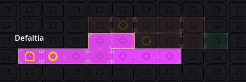

# Metroidvania System

Metroidvania System (abbrevated as MetSys) is a general-purpose toolkit for creating metroidvania games in Godot game engine. It helps with map design, navigation and presentation, tracking collectibles and provides basic save data functionality related to the system. It's components can be used independently, even for games that aren't metroidvanias.

## Getting started

MetSys is an addon and you install it normally - by copying the "addons/MetroidvaniaSystem" folder from this repository to the "addons/" directory in your project (create it if it doesn't exists). Once you copy the folder, go to Project -> Project Settings -> Plugins and tick the checkbox next to MetSys. Note that when the plugin is enabled for the first time, the editor will restart to properly setup the singleton. Once the plguin is activated, you will see MetSys button at the top of the Godot editor, next to 2D/3D views.


The addon comes with a sample project that shows example integration of the system. You can find more detailed instructions in this README.

### Terminology

This section explains the terminology used in this README and in the addon itself.
- Cell: The smallest unit of the game's world, represented by a square or rectangle on the game's map.
- Map: All of the placed cells, composing the game's world.
- Coords: Position of a Cell on the map, expressed as Vector3i(x, y, layer). In some cases layer is omitted.
- Border: Edge of a cell. There are 2 types of borders:
  - Wall: Solid border with no holes.
  - Passage: A border with hole or another feature that signifies passage (e.g. a door).
- Corner: Meeting point of 2 or more borders.
- Room: A collection of multiple cells enclosed by borders on every side. In game they are tied to a scene.
- Explored Cell: A cell visited by the player that appears normally.
- Mapped Cell: An unvisited cell discovered via a mapping item that usually appears grayed-out.

## Quick overview

Metroidvania System is designed as a general-purpose addon, mostly focused on 2D grid-based metroidvania games (either platformer or top-down). Grid-based, i.e. it assumes that the map is composed of rooms that fit on a square or rectangular grid. The main feature is the Map Editor, which helps designing the world layout by placing map cells and customizing them. The map, while it's only representation of the game's world, can be integrated with the game by associating scenes with rooms on the map, making the room transitions much easier to implement and the general overview on the world is more convenient.

A small, but important sub-system are object IDs. Whether it's a collectible, a switch, a breakable wall, some objects may need a persistent state. This is often achieved using a list of hard-coded "events". MetSys comes with an automated system that generates a unique ID for each object in scene (or outside scene); you can manage object persistence using just 2 methods with all-optional arguments. They can be used for non-metroidvania games too.

### Brief list of all features

#### Map Editor

- Place or remove map cells, connecting them in any grid-based shape.
- The map supports independent layers, allowing for sub-areas, parallel worlds etc.
- Map cells may have different colors and symbols.
- Cell borders are also colored independently and may have different textures.
- You can assign groups to cells, for easier runtime operations on multiple cells (like mapping or recoloring).
- Cells are automatically grouped in rooms and can have assigned scenes.
- You can define custom elements that draw arbitrary things on map (like elevators or location names).
- Add special RoomInstance node to your scene to display the borders of currently edited room inside the 2D editor view.

#### Map Viewer

- Same view as Map Editor, but provides more overview information.
- Click a room to open the assigned scene.
- A room is highlighted if it matches the currently opened scene.
- Define a list of collectibles found in your game, each with a name and an icon.
- Scan all scenes for collectibles from the list. They can be easily located afterwards and their total count is displayed.
- The collectibles can be also displayed on the world map, to get full overview.

#### Customize

- All map visual properties are stored in a custom resource - MapTheme, which can be swapped at any time (even at runtime).
- Cell appearance can be customized with textures and default colors for both center and borders.
- Cells can be either square or rectangular, providing separate set of borders for each shape.
- Cells support separators, i.e. soft-borders within the same room, to make the grid more accented.
- There is a texture for empty cells that can be drawn automatically.
- Mapped, unexplored cells, have a separate color set. You can also define what details are displayed for such cells
- Player location on map can be customized and displayed automatically.
- The player location can be marked per-cell or per-pixel.
- A special drawing mode called "Shared Borders", which makes each border shared between neighboring cells, instead of each cell having a separate inner border.

#### Misc

- Map data is stored in a custom text format, which is designed to be space-efficient and VCS-friendly.
- Map data can also be exported to JSON.
- Validate map data for unused symbols, passages to nowhere etc.
- Validate map theme for anything that potentially lead to an error, like mismatched sizes, missing textures etc.

#### Runtime features

- Specify in-game cell size, i.e. how a single cell size on the minimap relates to in-game world.
- Player position tracking using a single method, which automatically discovers cells and sends scene change requests.
- Override existing cells, assigning them different colors, borders, symbols or even scenes.
- Create and customize new ad-hoc cells to make random map generators.
- Register and store persistent objects to track their state using automatically or manually assigned IDs.
- Automatically mark discovered and acquired collectibles on the map.
- Request runtime save data in a form of a Dictionary, which contains discovered rooms, stored object IDs and customized cells.
- Get world map coordinates for any object on a scene.
- Helper method for custom drawign on map (for anything not supported by other features).

## Editor guide

The plugin screen is called Metroidvania System Database and it has 3 tabs: Map Editor, Map Viewer and Manage.


Map Editor is where you design your world map. Map Viewer provides overview of your map, integration with Godot editor's scenes and collectible statistics. Manage is where you manage themes and run validation.

### Map Editor

Map editor is divided into 2 main sections: map view and sidebar.


Map view is where you interact with your map - draw cells, edit borders, symbols etc. Sidebar contains navigation options, various editing modes and, depending on the mode, some options.

#### Navigation

It's important to note that the map is divided into layers. Using them is optional; they can be parallel worlds, interior sub-maps or whatever use-case you come up with. The editor properly displays a single layer, that is all cells, symbols, custom elements etc. Sometimes it's desired to see another layer at the same time, to make parallel rooms and stuff. This is what Preview Layer option is for - it allows to display another layer. It will be translucent and some elements are ommited, but you will see general shape of the layer.



You can change current layer either on the side-bar or using Q/E keys (physical). You can pan the map view using Middle Mouse Button; the Recenter View button on the sidebar moves you to (0, 0) in case you get lost (the canvas is infinite). In top-left corner of the map view you can see the coordinates of the hovered cell.

#### Room Layout mode

This is the most basic mode and allows you to draw rooms. The rooms are drawn using rectangle tool. Use Left Mouse Button to draw a room and Right Mouse Button to erase. If you draw a rectangle that overlaps another room, they will be merged.


#### Cell Color mode

This mode allows overriding the default cell color. Use LMB to assign the color, RMB to clear it (so default will be used). You can pick the color using the color picker on the sidebar or by Ctrl+Clicking a colored cell.

[GIF]

#### Cell Symbol mode

Mode that allows drawing cell symbols. A symbol may represent a save point, teleport, treasure, anything. Symbols need to be registered in the [theme] first, then you can select one from the list on the sidebar. Use LMB to draw symbol, RMB to remove. A cell may have only a single symbol.

[GIF]

Symbols are more useful at runtime. They can be assigned dynamically and automatically.
If you added a new symbol and it's missing from the list, you can use Force Refresh Elements option in [Manage tab](#manage).

#### Cell Group mode

Assign cell groups here. Select group ID on the sidebar, use LMB to assign selected group and RMB to unassign. Cell groups are a mean to operate on multiple cells at once. The most common use case are maps items that discover a portion of the world map. A call may belong to any number of groups.

[GIF]

#### Border Type mode

This mode allows changing room's borders. There are 2 default border types: wall and passage. More border types can be registered in the [theme]. They can be doors, special bariers or narrow passages, anything. A cell's edge will be highlighted when hovering near it with cursor. Draw borders using LMB, remove (reset to wall) with RMB. You can hold and drag to draw multiple borders; useful when you want to draw them at both sides of an edge.
If you added a new border type and it's missing from the list, you can use Force Refresh Elements option in [Manage tab](#manage).

[GIF]

#### Border Color mode

Border colors can be changed separately from cell color. The process is the same - use picker or Ctrl to select color, use LMB/RMB to draw/remove color.

[GIF]

#### Scene Assign mode

This mode allows to assign scenes to rooms on the map. The scenes are used in editor in the Map Viewer and at runtime for room switching. MetSys will automatically detect enclosed rooms; click one to open a file dialog that lets you choose a scene. Only scenes from the [designated scene directory] can be selected. Rooms with scenes assigned are highlighted and hovering them will display the assigned scene name in top-left.

[GIF]

#### Custom Elements mode

In this mode you can draw custom elements, like special multi-cell markers, elevators, map labels, anything. They need to be first [defined in the main config]. Elements in the editor are drawn as rectangles, but they occupy only their top-left cell. Use LMB to draw an element and RMB on its origin cell to erase it. You can provide a custom String data that will be provided for the draw callback of the element.
If you added a new custom elemnet and it's missing from the list, you can use Force Refresh Elements option in [Manage tab](#manage).

[GIF]

### Map Viewer

Like Map Editor, Map Viewer is divided into sidebar and map view. The top of the sidebar has the same navigation controls, minus the other layer preview.

In Map Viewer you can't edit the map, instead it provides a few tools that allows you to navigate your world more easily.

#### Scene integration

The main feature of Map Viewer is that it's integrated with your map scenes. If you assigned scenes to your rooms, you can open tha assigned scene when clicking the room.

[GIF]

This works both ways. When you open a scene in the editor, it will be highlighted in the viewer.

[GIF]

Hovering over a room will display the assigned scene name. If there is no scene assigned, the coordinate label changes color.

#### Collectible statistics

This feature allows you to locate and display all registered collectibles that you placed on your scenes. The first step is setting up your collectibles, which is done in the Collectible Settings tab.

[screenshot]

Press + button to add a collectible, then specify its name and icon. Name **must** match the name of the node in collectible's scene (or at least its prefix; nodes named Collectible1 and Collectible2 will be matched "Collectible"). The icon is just a representation of the collectible for the purposes of finding.

Once your collectibles are set up, go to the Collectible Finder tab and press the Scan Maps button. MetSys will perform a scan of all scenes in your maps directory. Once complete, you will see a list of all found collectibles and their coordinates. Hovering on a coordinate on the list will highlight it on the map (even if it's on another layer). You can also enable Display on Map to show all the collectibles as icons on the map.

[GIF]

### Manage

Unlike the other 2 tabs, Manage has no map view. Instead is's a simple list of options.

[screenshot]

#### General Settings

Selecting General Settings option will open the MetSys settings file in the inspector. By default the file is located at `res://MetSysSettings.tres`, but you can move it by modifying `metroidvania_system/settings_file` project setting.

General Settings are a configuration file for MetSys plugin in your project.
- Theme: the map theme of your project. It determines how map cells are drawn. See [Map Theme section](#map-theme) for more details.
- Map Root Folder: the location of your world's scenes (see [scenes]). All scenes you want to assign to your rooms need to be inside this directory or its subdirectories.
- In Game Cell Size: The size of one cell of a room as it appears in game (not on map). It affects how [exact player position] is display on map and also affects camera bounds (if adjusted).
- Custom Element Script: script defining available custom elements. See [Custom Element Script section](#custom-element-script) for more details.

#### Validation

There are two kinds of validation: map data validation and map theme validation. Validation checks if the validated data is correct, to prevent errors and crashes. If it results in errors, you need to fix them, otherwise your map/theme won't work correctly. Warnings can be ignored.

Map data validation checks the integrity of your world. It most importantly checks for invalid data (symbols and borders) that would make your project work incorrectly, but also gives some potential warnings. The checks are as follows (*italic* are warnings):
- Invalid symbol: Cell's symbol index does not exist on the symbol list. It will result in an error when drawing.
- Invalid border: Cell's border style does not exist on the border list. It will result in an error when drawing.
- *No assigned map:* Room has no assigned map. Has no adverse effects, other than not emitting a signal when entering the room area.
- *Passage to nowhere:* Room has a passage border with no adjacent room. Since all custom border styles are considered passage, this is prone to false-positives.
- *Potentially unused symbol:* A symbol is not placed anywhere nor used as default for collectibles. This does not detect symbols assigned from code.

Theme data validation ensures that the map theme you are using is correctly defined. This part is much more prone to error that will break your map display, so it's important to fix all found errors. Other than validation, this option will also display some inferred info about the theme, i.e. cell size and shape (square/rectangle). The checks are as follows (*italic* are warnings):
- Missing center texture: The theme has no center texture assigned. It's the most important piece, so the validation stops if this error is found.
- Size mismatch between empty texture and center texture: Empty texture and center texture must match in size, otherwise they wouldn't display correctly. Can only appear if empty texture is defined.
- Number of horizontal and vertical borders do not match: In rectangle shape theme, you need to provide separate borders for horizontal and vertical edges.
- Border has invalid height: all border sprites must be oriented vertically, including horizontal borders. It makes the rotation code simpler.
- Border is empty: Border array has null value or invalid texture.
- Player location scene is not a Node2D: The player location needs to be Node2D to display on map.
- (Un)collected item symbol index is greater than number of available symbols: the default collectible symbols need to be within the defined symbols range.
- *Symbol is bigger than center texture*: Not critical, but it makes the symbol stick outside the cell.
- *Texture is is wider than half of the center texture*: This applies to borders. They should be thing horizontally, otherwise they won't display properly.
- *Missing player location scene*: If player location scene is missing, the system for drawing player location on map can't be used.

#### Database Theme

The theme used for MetSys database. This defines colors used in various areas. You can modify them if they happen to be unreadable when used with your map theme. Here are the colors available for customization:
- Active Custom Element - In Custom Elements editor mode, this color is used for elements on map that match the currently selected element type on the sidebar.
- Assigned Scene - Room highlight in Scene Assign editor mode.
- Border Highlight - Border hover highlight in border editing modes.
- Current Scene Room - Highlight color for the Map Viewer room matched with the currently opened editor scene.
- Cursor Color - Color of the editor cell cursor (square/rectangle).
- Cursor Color Erase - Same as above, but used when erasing cells in Room Layout editor mode.
- Custom Element Marker - Color of the marker denoting origin point of an element in Custom Elements editor mode.
- Foreign Marked Collectible Room - Highlight color for the cell when hovering over a collectible in Collectible Finder list, when the collectible is on a different layer than currently selected.
- Group Color - Highlight color for cells in Cell Group editor mode.
- Highlighted Room - Highlight color for the hovered room in Scene Assign editor mode.
- Inactive Custom Element - Opposite of the active element, i.e. elements with different type than selected.
- Marked Collectible Room - Same as marked collectible above, but used for the same layer.
- Room Assigned - Font color when hovering a room with scene assigned in Map Viewer.
- Room Not Assigned - Same as above, but room has no scene.
- Scene Cell Border - Used for marking room edges when a scene with room assigned is opened in the 2D editor.
- Scene Room Exit - Same as above, but for passages.

#### Custom Element Script

Custom Element script must be a `@tool` script that extends `MetroidvaniaSystem.CustomElementManager`. The elements are registered in the constructor (`_init()`) using `register_element(element_name: String, callback: Callable)` (e.g. `register_element("label", draw_label)`). Once you define the list of elements and add the script in [General Settings](#general-settings) (make sure to use Force Refresh Elements option or restart the editor), you can place the elements in Custom [Elements mode in the map editor](#custom-elements-mode).

For elements to draw on in-game map, you need to call `MetSys.draw_custom_elements()`, which will automatically draw relevant elements using their callbacks (note that this only applies to your in-game implementation, as MetSys Database calls this method already). The callback is as follows: `func function_name(canvas_item: CanvasItem, coords: Vector3i, pos: Vector2, size: Vector2, data: String)`.
- `function_name`: you need to provide this name to `register_callback()`.
- `canvas_item`: The CanvasItem node that will draw the element.
- `coords`: Cell coordinates on the world map.
- `pos`: Position of the top-left corner of the element, in pixels.
- `size`: Size of the element's rectangle, in pixels.
- `data`: The data string provided when creating the element.

Using these arguments, you need to draw your element using any available custom drawing method. For example:
```GDScript
canvas_item.draw_texture(preload("res://icon.svg"), pos)
```
Note that all elements within the visible area are drawn regardless if they are discovered or not. You need to manually check if the cell occupied by element (or any related cell you want to consider) was discovered, using `MetSys.is_cell_discovered(coords)`.

## Runtime guide

This section provides information about usage of MetSys features at runtime, i.e. in your game itself.

can't have multiple handlers in tree

## Map Theme

### Properties

### List of included example themes

The addon comes with a few themes *inspired* by various metroidvania games.

#### AoS


Inspired by Castlevania: Aria of Sorrow. Simple blue squares with white, shared borders. Notably it displays room connections as colored lines. Has no symbols. Player location is white shrinking dot, unexplored rooms display all connections.
#### BS


Inspired by Bloodstained: Ritual of the Night. Rectangular light-blue cells with shared borders and normal room connections (i.e. hole-like). Also no symbols. Player location is a stylized dot showing exact location and passages show normally in unexplored rooms.
#### Exquisite


Original (and default) theme created for MetSys. Rectangular cells, customizes every available element of the theme to look fancy. Has a few random symbols. Player location is a rotating symbol that shows exact position. Symbols appear in unexplored rooms, but not passages.
#### MF


Inspired by Metroid Fusion. Simple square cells defaulting to magenta color and a texture for empty cells. Has a bunch of symbols and extra border styles for doors. Includes symbols for collected and uncollected items. Player location is a blinking square. Symbols appear in unexplored rooms, but not passages.
#### SotN


Inspired by Castlevania: Symphony of the Night. Basically the same as BS, but with square rooms. Player location similar to AoS, but animated a bit differently.
#### RR


Inspired by Rabi-Ribi. Unlike other themes, cell borders are colored. Has many symbols, including various collectibles. Notably, the collectible symbols are displayed only when a collectible is acquired. Player locations is a rounded square with smoothed blinking. Unexplored rooms display everything normally.
#### VoF


Inspired by Voice of Flowers (which is created by me). In fact it uses some of the old sprites from the game. Square cells with visible separators and a texture for empty space. Has a bunch of various symbols of mixed quality and an extra border style for abyss. No symbols for collectibles. Player location is a rotating head. Unexplored rooms don't display anything, just cell color without any borders.
#### Zeric


Inspired by map guides made by user Zeric ([Example](https://gamefaqs.gamespot.com/gba/589456-castlevania-aria-of-sorrow/map/772-castle-map)). The only theme that uses all possible corner styles for shared borders. Has a few non-collectible symbols and extra border styles. Player locations is a symbol, unexplored rooms display everything.

## Sample project

Info co gdziej jest w przykładowym projekcie