#  Metroidvania System

Metroidvania System (abbrevated as MetSys) is a general-purpose toolkit for creating metroidvania games in Godot game engine. It helps with map design, navigation and presentation, tracking collectibles and provides basic save data functionality related to the system. Its components can be used independently, even for games that aren't metroidvanias.

This plugin evolved from various tools I made for my metroidvania game, [Voice of Flowers](https://store.steampowered.com/app/2609560?utm_source=GitHub&utm_medium=README_TOP&utm_campaign=MetSys). They were quite useful, so I decided to make them into a separate project that can be used in other games too.

Supports Godot **4.2** or newer.

## Getting started

MetSys is an addon and you install it normally - by copying the "addons/MetroidvaniaSystem" folder from this repository to the "addons/" directory in your project (create it if it doesn't exists). Once you copy the folder, go to Project -> Project Settings -> Plugins and tick the checkbox next to MetSys. Note that when the plugin is enabled for the first time, the editor will restart to properly setup the singleton. Once the plugin is activated, you will see MetSys button at the top of the Godot editor, next to 2D/3D views.

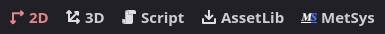

**Important:** Don't use MetSys with Godot 4.1 or older. The system uses some features available only in Godot 4.2 and if the scripts can't compile, enabling the addon will result in infinite editor restart loop.

### Terminology

This section explains the terminology used in this README and in the addon itself.
- Cell: The smallest unit of the game's world, represented by a square or rectangle on the game's map.
- Map: All of the placed cells, composing the game's world.
- Coords: Position of a Cell on the map, expressed as Vector3i(x, y, layer). In some cases the layer is omitted.
- Border: Edge of a cell. There are 2 types of borders:
	- Wall: Solid border with no holes.
	- Passage: A border with hole or another feature that signifies passage (e.g. a door).
- Corner: Connecting point of 2 or more non-parallel borders.
- Room: A collection of multiple cells enclosed by borders on every side. In game they are tied to a scene.
- Mapped Cell: An unvisited cell. Usually discovered via a mapping item and appears grayed-out.
- Explored Cell: A cell visited by the player that appears normally.
- Discovered Cell: A cell either mapped or explored.

### Quick Start

There are 2 ways to start using MetSys: implementing the integration from scratch and using the example project as base. Note that while the system provides lots of different functionality, integrating it in the project does require some quite a bit of code. The latter approach of starting off the sample project is recommended.

#### Starting from scratch

After adding the plugin and enabling it, a file called `MetSysSettings.tres` will appear in your project. It contains settings for the plugin. You can move it to any directory, but you should modify `addons/metroidvania_system/settings_file` to point to the new path. Next thing to do is edit the settings file and customize all the fields (see [here](#general-settings) for more info). The most important one is `map_root_folder`, which defines where will your map scenes go. This is also the location of your `MapData.txt` file, which stores the world layout.

Whenever you start the game, you should call `MetSys.reset_state()` and `MetSys.set_save_data()` to make sure the singleton is in the initial state and save data exists. Then you have to call `MetSys.set_player_position()` every time the player moves (or simply every frame, the method is not expensive). This will cause the  `MetSys.cell_changed` signal to be emitted when player moves to another map cell and `MetSys.room_changed` when player moves to another room (this is when you are supposed to load a new scene). See [here](#tracking-player-position) for more info.

Create your map layout in the Map Editor and assign the scenes from your map folder. Every room should have instance of `RoomInstance.tscn` scene to properly tie it to the system. When you start your game in such scene, MetSys will automatically detect which room you are in and the position tracking will handle the rest. To draw the map use `MetSys.draw_cell()` method. See [here](#drawing-the-map) for more info.

These are the basics that allow you to craft the world and move within it. For more information read this manual and/or the documentation.

#### Starting from sample project

Sample project comes with many systems in place. They aren't fully optimized, but it's still a good starter.

When adding MetSys to existing project make sure to setup the plugin as described in the previous section, that is `addons/metroidvania_system/settings_file` should point to the `MetSysSettings.tres` file (called `Settings.tres` in example project) and the map directory configured in the settings must be valid.

The project comes with the default room size, so you may want to change that too. The most relevant piece for you will be the `Game.tscn` scene. You should remove the map scenes and remove all cells in the Map Editor (or just open `MapData.txt` and clear it, then press "Reload and Cleanup Map Data" in Manage tab). Modify `Game.tscn` to adapt it to your game (or just copy the code you want to use, as the scene has minimap and barebones map screen).

With that setup you should have a nice base to continue your project.

## Quick overview

Metroidvania System is designed as a general-purpose addon, mainly focused on 2D grid-based metroidvania games (either platformer or top-down). Grid-based, i.e. it assumes that the map is composed of rooms that fit on a square or rectangular grid. The main feature is the Map Editor, which helps designing the world layout by placing the map cells and customizing them. The map, while it's only representation of the game's world, can be integrated with the game by associating scenes with rooms on the map, making the room transitions much easier to implement and the general overview of the world is more convenient.

A small but important sub-system are object IDs. Whether it's a collectible, a switch, a breakable wall, some objects may need a persistent state. This is often achieved using a list of hard-coded "events". MetSys comes with an automated system that generates a unique ID for each object in scene (or outside scene); you can manage object persistence using just 2 methods with all-optional arguments. They can be used for non-metroidvania games too.

### Brief list of all features

#### Map Editor

- Place or remove map cells, connecting them in any grid-based shape.
- The map supports independent layers, allowing for sub-areas, parallel worlds etc.
- Map cells may have different colors and symbols.
- Cell borders are also colored independently and may have different textures.
- You can assign groups to cells, for easier runtime operations on multiple cells (like mapping or recoloring).
- Cells are automatically grouped into rooms and can have assigned scenes.
- You can define custom elements that draw arbitrary things on map (like elevators or location names).
- Add a special RoomInstance node to your scene to display the borders of currently edited room inside the 2D editor view.

#### Map Viewer

- Same view as Map Editor, but provides more overview information.
- Click a room to open the assigned scene.
- A room is highlighted if it matches the currently opened scene.
- Define a list of collectibles found in your game, each with a name and an icon.
- Scan all scenes for collectibles from the list. They can be easily located afterwards and their total count is displayed.
- The collectibles can be also displayed on the world map, to get full overview.

#### Customize

- All map visual properties are stored in a custom resource - MapTheme, which can be swapped at any time (even at runtime).
- Cell appearance can be customized with textures and default colors for both center and borders.
- Cells can be either square or rectangular, providing separate set of borders for each shape.
- Cells support separators, i.e. soft-borders within the same room, to make the grid more accented.
- There is a texture for empty cells that can be drawn automatically.
- Mapped cells have a separate color set. You can also define what details are displayed for such cells.
- Player location on map can be customized and displayed automatically.
- The player location can be marked per-cell or per-pixel.
- A special drawing mode called "Shared Borders", which makes each border shared between neighboring cells, instead of each cell having a separate inner border.

#### Misc

- Map data is stored in a custom text format, which is designed to be space-efficient and VCS-friendly.
- Map data can also be exported to JSON.
- Validate map data for unused symbols, passages to nowhere etc.
- Validate map theme for anything that potentially leads to an error, like mismatched sizes, missing textures etc.

#### Runtime features

- Specify in-game cell size, i.e. how a single cell size on the minimap relates to in-game world.
- Player position tracking using a single method, which automatically discovers cells and sends scene change requests.
- Override existing cells, assigning them different colors, borders, symbols or even scenes.
- Create and customize new ad hoc cells to make random map generators.
- Register and store persistent objects to track their state using automatically or manually assigned IDs.
- Automatically mark discovered and acquired collectibles on the map.
- Request runtime save data in a form of a Dictionary, which contains discovered rooms, stored object IDs and customized cells. It can be loaded back at any time.
- Get world map coordinates for any object on a scene.
- Helper method for custom drawign on map (for anything not supported by other features).

## Editor guide

The plugin screen is called Metroidvania System Database and it has 3 tabs: Map Editor, Map Viewer and Manage.

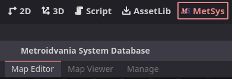

Map Editor is where you design your world map. Map Viewer provides overview of your map, integration with Godot editor's scenes and collectible statistics. Manage is where you manage themes and run validation. Interacting with the map editor requires no code (aside from one feature).

### Map Editor

Map editor is divided into 2 main sections: map view and sidebar.

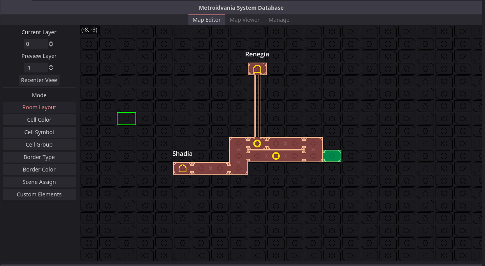

Map view is where you interact with your map - draw cells, edit borders, symbols etc. Sidebar contains navigation options, various editing modes and, depending on the mode, some options.

#### Navigation

It's important to note that the map is divided into layers. Using them is optional; they can be parallel worlds, interior sub-maps or whatever use-case you come up with. The editor properly displays a single layer, that is all cells, symbols, custom elements etc. Sometimes it's desired to see another layer at the same time, to make parallel rooms and stuff. This is what Preview Layer option is for - it allows to display another layer. It will be translucent and some elements are omitted, but you will see general shape of the layer.

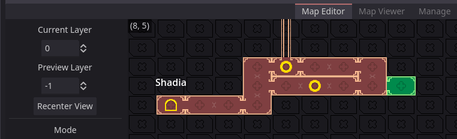

You can change current layer either on the side-bar or using Q/E keys (physical). You can pan the map view using Middle Mouse Button; the Recenter View button on the sidebar moves you to (0, 0) in case you get lost (the canvas is infinite). In the top-left corner of the map view you can see the coordinates of the hovered cell.

#### Room Layout mode

This is the most basic mode and allows you to draw rooms. The rooms are drawn using rectangle tool. Use Left Mouse Button to draw a room and Right Mouse Button to erase. If you draw a rectangle that overlaps another room, they will be merged.

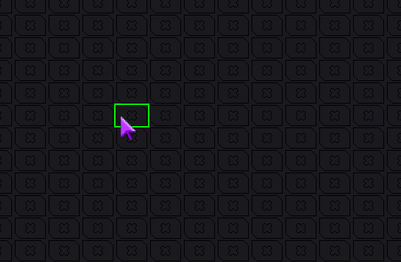

Note that any modifications to a room will remove its assigned scene.

#### Cell Color mode

This mode allows overriding the default cell color. Use LMB to assign the color, RMB to clear it (so default will be used). You can pick the color using the color picker on the sidebar or by Ctrl+Clicking a colored cell. You can also color the whole room at once by holding Shift.

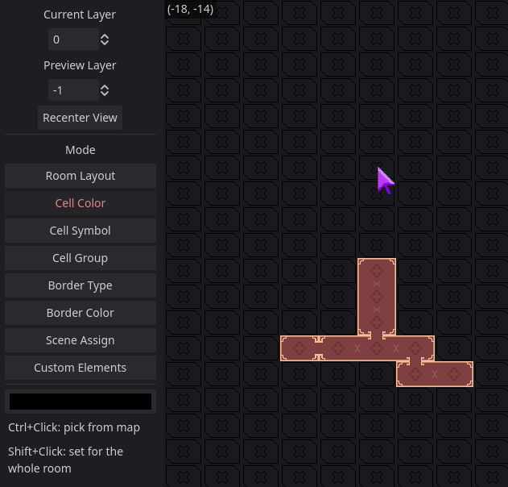

#### Cell Symbol mode

Mode that allows drawing cell symbols. A symbol may represent a save point, teleport, treasure, anything. Symbols need to be registered in the [theme](#map-theme) first, then you can select one from the list on the sidebar or by Ctrl+Clicking a cell with a symbol. Use LMB to draw symbol, RMB to remove. A cell may have only a single symbol.

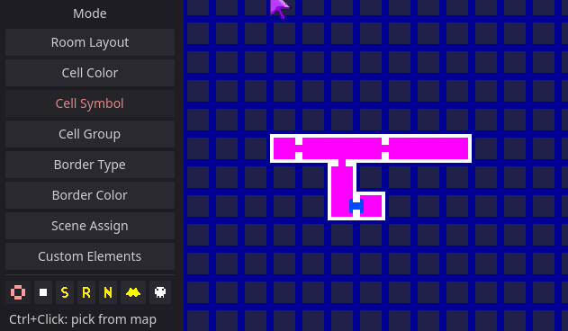

Symbols are more useful at runtime. They can be [assigned dynamically and automatically](#markers).

#### Cell Group mode

Assign cell groups here. Select group ID on the sidebar, use LMB to assign selected group and RMB to unassign. Holding Shift will add or remove group to the whole room. Cell groups are a mean to operate on multiple cells at once. The most common use case are [maps items that discover a portion of the world map](#discovering). A call may belong to any number of groups.

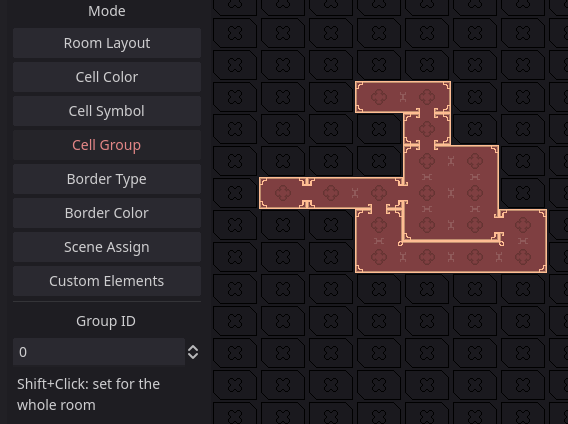

#### Border Type mode

This mode allows changing room's borders. There are 2 default border types: wall and passage. More border types can be registered in the [theme](#map-theme). They can be doors, special barriers or narrow passages, anything. A cell's edge will be highlighted when hovering near it with cursor. You can pick a border type from the sidebar list or by Ctrl+Clicking a border. Draw borders using LMB, remove (reset to wall) with RMB. You can hold and drag to draw multiple borders; useful when you want to draw them at both sides of an edge. Also holding Shift will set the borders for the whole room.

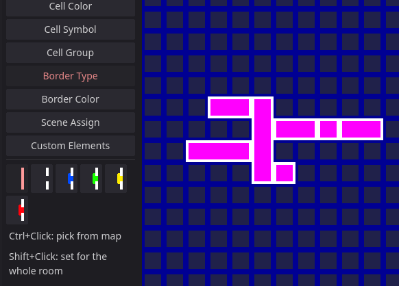

#### Border Color mode

Border colors can be changed separately from the cell color. The process is the same - use picker or Ctrl to select color, use LMB/RMB to draw/remove color, hold Shift to set color for all borders in a room.

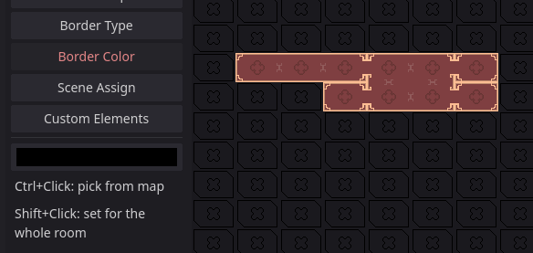

#### Scene Assign mode

This mode allows to assign scenes to rooms on the map. The scenes are used in editor in the Map Viewer and at runtime for room switching. MetSys will automatically detect enclosed rooms; click one to open a file dialog that lets you choose a scene. Only scenes from the [designated scene directory](#general-settings) can be selected. Rooms with scenes assigned are highlighted and hovering them will display the assigned scene name in top-left.

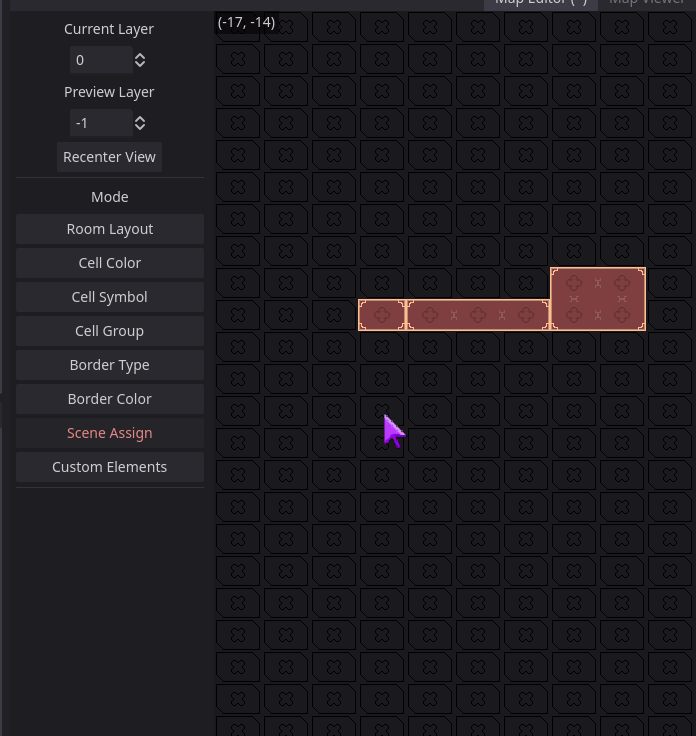

#### Custom Elements mode

In this mode you can draw custom elements, like special multi-cell markers, elevators, map labels, anything. They need to be first [defined in the main config](#general-settings). Elements in the editor are drawn as rectangles, but they occupy only their top-left cell. Use LMB to draw an element and RMB on its origin cell to erase it. You can provide a custom String data that will be passed to the draw callback of the element.

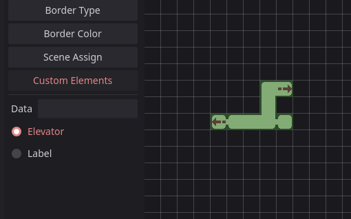

Custom element is drawn only if a part of its area is within the drawn coordinates Make sure the content is encompassed to avoid wrong culling. If the custom element list does not match what you defined, you can use Refresh Custom Elements option in the [Manage tab](#manage).

### Map Viewer

Like Map Editor, Map Viewer is divided into sidebar and map view. The top of the sidebar has the same navigation controls, except the other layer preview is replaced with Preview Mapped. When that last option is enabled, the map will draw in the mapped style, i.e. discovered, but not visited by player.

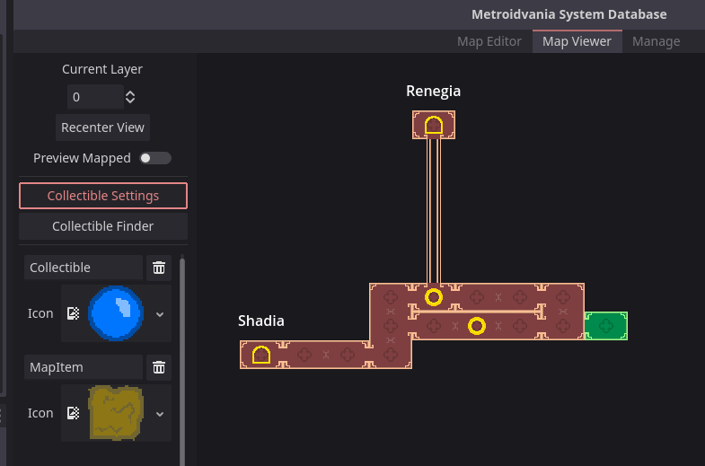

In Map Viewer you can't edit the map, instead it provides a few tools that allows you to navigate your world more easily.

#### Scene integration

The main feature of Map Viewer is that it's integrated with your map scenes. If you assigned scenes to your rooms, you can open tha assigned scene when clicking the room.

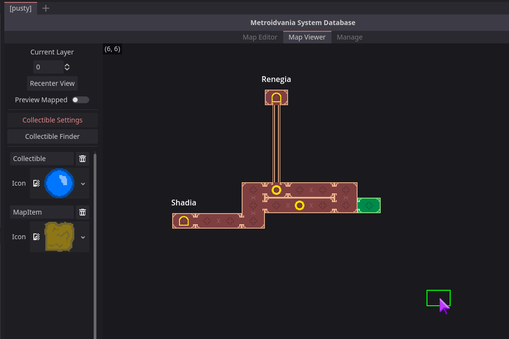

This works both ways. When you open a scene in the editor, it will be highlighted in the viewer. Hovering over a room will display the assigned scene name. If there is no scene assigned, the coordinate label changes color.

#### Collectible statistics

This feature allows you to locate and display all registered collectibles that you placed on your scenes. The first step is setting up your collectibles, which is done in the Collectible Settings tab.

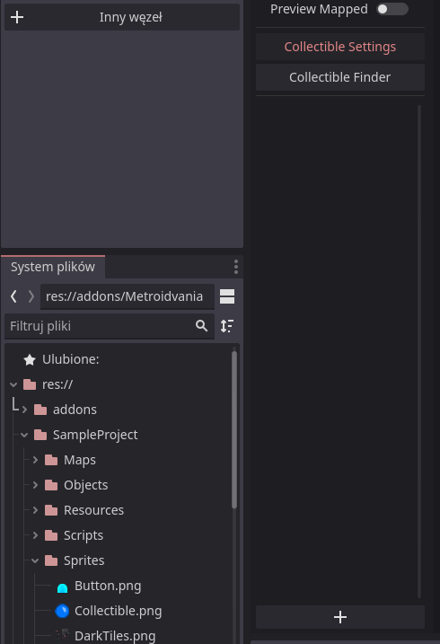

Press + button to add a collectible, then specify its name and icon. Name **must** match the name of the node in collectible's scene (or at least its prefix; nodes named Collectible1 and Collectible2 will be matched "Collectible"). The icon is just a representation of the collectible for the purposes of finding.

Once your collectibles are set up, go to the Collectible Finder tab and press the Scan Maps button. MetSys will perform a scan of all scenes in your maps directory. Once complete, you will see a list of all found collectibles and their coordinates. Hovering on a coordinate on the list will highlight it on the map (even if it's on another layer). You can also enable Display on Map to show all the collectibles as icons on the map.

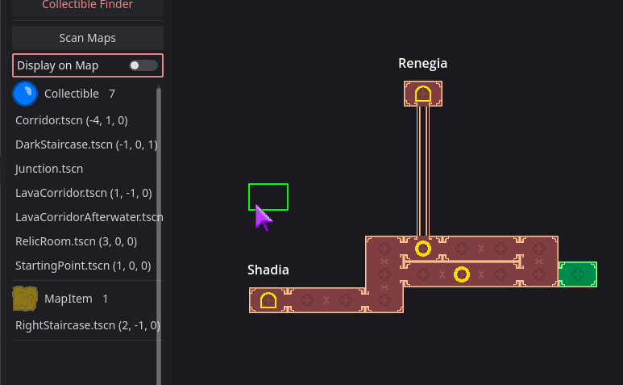

### Manage

Unlike the other 2 tabs, Manage has no map view. Instead it's a simple list of options.

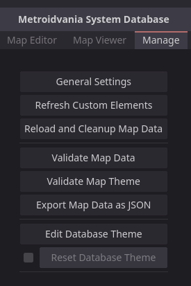

#### General Settings

Selecting General Settings option will open the MetSys settings file in the inspector. By default the file is located at `res://MetSysSettings.tres`, but you can move it by modifying `addons/metroidvania_system/settings_file` project setting.

General Settings are a configuration file for MetSys plugin in your project.
- Theme: the map theme of your project. It determines how map cells are drawn. See [Map Theme section](#map-theme) for more details.
- Map Root Folder: the location of your world's scenes (see [scene assign](#scene-assign-mode)). All scenes you want to assign to your rooms need to be inside this directory or its subdirectories. `MapData.txt`, which stores the map information, is also located in this folder.
- In Game Cell Size: The size of one cell of a room as it appears in game (not on map). It affects how [exact player position](#tracking-player-position) is display on map and also affects camera bounds (if adjusted).
- Custom Element Script: script defining available custom elements. See [Custom Element Script section](#custom-element-script) for more details.

#### Validation

There are two kinds of validation: map data validation and map theme validation. Validation checks if the validated data is correct, to prevent errors and crashes. If it results in errors, you need to fix them, otherwise your map/theme won't work correctly. Warnings can be ignored.

Map data validation checks the integrity of your world. It most importantly checks for invalid data (symbols and borders) that would make your project work incorrectly, but also gives some potential warnings. The checks are as follows (*italic* are warnings):
- Invalid symbol: Cell's symbol index does not exist on the symbol list. It will result in an error when drawing.
- Invalid border: Cell's border style does not exist on the border list. It will result in an error when drawing.
- *No assigned map:* Room has no assigned map. Has no adverse effects, other than not emitting a signal when entering the room area.
- *Passage to nowhere:* Room has a passage border with no adjacent room. Since all custom border styles are considered passage, this is prone to false-positives.
- *Potentially unused symbol:* A symbol is not placed anywhere nor used as default for collectibles. This does not detect symbols assigned from code.

Theme data validation ensures that the map theme you are using is correctly defined. This part is much more prone to error that will break your map display, so it's important to fix all found errors. Other than validation, this option will also display some inferred info about the theme, i.e. cell size and shape (square/rectangle). The checks are as follows (*italic* are warnings):
- Missing center texture: The theme has no center texture assigned. It's the most important piece, so the validation stops if this error is found.
- Size mismatch between empty texture and center texture: Empty texture and center texture must match in size, otherwise they wouldn't display correctly. Can only appear if empty texture is defined.
- Number of horizontal and vertical borders do not match: In a rectangle shape theme you need to provide separate borders for horizontal and vertical edges.
- Border has invalid height: All border sprites must be oriented vertically, including horizontal borders. It makes the rotation code simpler.
- Border is empty: Border array has a null value inside or an invalid texture.
- Player location scene is not a Node2D: The player location needs to be Node2D to be displayed on map.
- (Un)collected item symbol index is greater than number of available symbols: The default collectible symbols need to be within the defined symbols range.
- *Symbol is bigger than center texture*: Not critical, but it makes the symbol stick outside the cell.
- *Texture is wider than half of the center texture*: This applies to borders. They should be thin horizontally, otherwise they won't display properly.
- *Missing player location scene*: If player location scene is missing, the system for drawing player location on map can't be used.

#### Database Theme

The theme used for MetSys database. This defines colors used in various areas. You can modify them if they happen to be unreadable when used with your map theme. Here are the colors available for customization:
- Active Custom Element - In Custom Elements editor mode, this color is used for elements on the map that match the currently selected element type on the sidebar.
- Assigned Scene - Room highlight in Scene Assign editor mode when a scene was assigned.
- Border Highlight - Border hover highlight in border editing modes.
- Current Scene Room - Highlight color for the Map Viewer room matched with the currently opened editor scene.
- Cursor Color - Color of the editor cell cursor (square/rectangle).
- Cursor Color Erase - Same as above, but used when erasing cells in Room Layout editor mode.
- Custom Element Marker - Color of the marker denoting origin point of an element in Custom Elements editor mode.
- Foreign Marked Collectible Room - Highlight color for the cell when hovering over a collectible in Collectible Finder list, when the collectible is on a different layer than currently selected.
- Group Color - Highlight color for cells in Cell Group editor mode when group is assigned.
- Highlighted Room - Highlight color for the hovered room in Scene Assign editor mode and other modes that support full room operations.
- Inactive Custom Element - Opposite of the active element, i.e. elements with different type than selected.
- Marked Collectible Room - Same as marked collectible above, but used for the same layer.
- Room Assigned - Font color when hovering a room with scene assigned in Map Viewer.
- Room Not Assigned - Same as above, but room has no scene.
- Scene Cell Border - Used for marking room edges when a scene with room assigned is opened in the 2D editor.
- Scene Room Exit - Same as above, but for passages.

Using the Reset Database Theme button you can restore the original colors. Note that this action is irreversible.

#### Custom Element Script

Custom Element script must be a `@tool` script that extends `MetroidvaniaSystem.CustomElementManager`. The elements are registered in the constructor (`_init()`) using `register_element(element_name: String, callback: Callable)` (e.g. `register_element("label", draw_label)`). Once you define the list of elements and add the script in [General Settings](#general-settings) (make sure to use Refresh Custom Elements option after adding script or elements), you can place the elements in Custom [Elements mode in the map editor](#custom-elements-mode).

For elements to draw on in-game map, you need to call `MetSys.draw_custom_elements()`, which will automatically draw relevant elements using their callbacks (note that this only applies to your in-game implementation, as MetSys Database calls this method already). The callback is as follows: `func function_name(canvas_item: CanvasItem, coords: Vector3i, pos: Vector2, size: Vector2, data: String)`.
- `function_name`: you need to provide this name to `register_callback()`.
- `canvas_item`: The CanvasItem node that will draw the element.
- `coords`: Cell coordinates on the world map.
- `pos`: Position of the top-left corner of the element, in pixels.
- `size`: Size of the element's rectangle, in pixels.
- `data`: The data string provided when creating the element.

Using these arguments, you need to draw your element using any available custom drawing method. For example:
```GDScript
canvas_item.draw_texture(preload("res://icon.svg"), pos)
```
Note that all elements within the visible area are drawn regardless if they are discovered or not. You need to manually check if the cell occupied by element (or any related cell you want to consider) was discovered, using `MetSys.is_cell_discovered(coords)`.

#### Other options

Two remaining options in the Manage tab are:
- Reload and Cleanup Map Data: As the name says, this will force reload map data from file and also cleanup invalid data like scenes assigned to non-existent cells etc. (note that such data can be created only as a result of a bug or manual tampering with the map data file).
- Export Map as JSON: Exports the contents of MapData.txt as JSON, in case you want to use it in external tools or just not rely on custom format (MetSys itself does not support JSON).

## Runtime guide

This section provides information about usage of MetSys features at runtime, i.e. in your game itself.

### Code structure

Unlike in the editor, at runtime all interactions with MetSys are through code. The main code component is MetSys autoload singleton automatically added with the plugin. All interactions with the system go through the singleton, that includes methods and signals. The code is fully documented as a class called MetroidvaniaSystem. It has multiple additional components in form of preloaded scripts. Anything that doesn't have description is not intended to be called/accessed by the user (but of course it's possible if you want to do some advanced hacks).

You can check the included [example project](#sample-project) if you are unsure how to implement some things.

### Room Instance

The base bridge between MetSys and your game is RoomInstance node. You can find it under Nodes in MetroidvaniaSystem addon folder. It provides two-fold functionality: allows to identify the current room when it's visited in game and draws room boundaries in the editor. You can put this node anywhere in the scene, but keep in mind that the position affects where the bounds are drawn. You should add RoomInstance to every room with assigned scene.

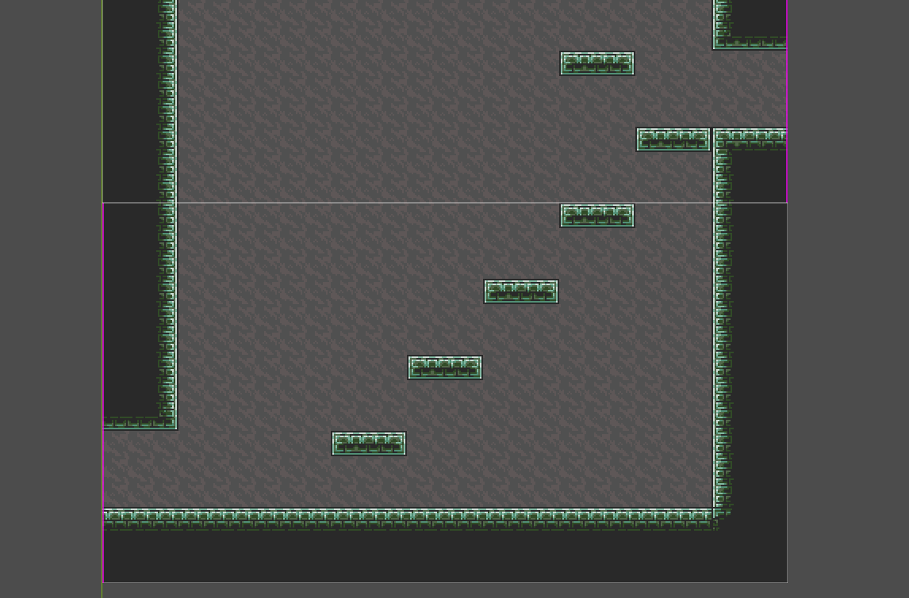

The white lines are borders of map cells, while the magenta lines are mark connections to adjacent rooms. You can configure the colors in [Database Theme](#database-theme). Size of the cell is defined by In Game Cell Size of [General Settings](#general-settings).

The RoomInstance node can be accessed using `MetSys.current_room`. It grants access to a few useful methods:
- `adjust_camera_limits(camera: Camera2D)`: Adjusts limit properties of the given camera to be within the room's boundaries.
- `get_size() -> Vector2`: Returns the size size of the room's bounding rectangle.
- `get_local_cells() -> Array[Vector2i]`: Returns the cells occupied by the room, in local coordinates, i.e. (0, 0) is the top-left coordinate. This is useful to determine shape of irregular (not-rectangle) rooms to draw stuff outside the map etc.
- `room_name`: This property holds the name of the room (i.e. file name of the scene).

Note that since RoomInstance is basically a singleton within MetSys, only one can be functional inside scene tree. When RoomInstance enters tree, it will assign itself to MetSys and automatically remove itself when left. If you happen to have multiple room instances (which should be avoided), the newest one will have priority.

### Drawing the map

Another important feature is drawing the world map. Usually the map is drawn in form of minimap and a full map on a separate screen. The drawing methods are basic enough to cover any use-case.
The basic way to draw map is using `MetSys.draw_cell()` method. It takes several arguments:
- `canvas_item`: The CanvasItem that will do the drawing (e.g. your minimap panel).
- `offset`: Drawing offset of the cell, in map coordinates. E.g. (1, 1) will offset cell the cell by `MetSyS.CELL_SIZE` (size of a map cell in pixels).
- `coords`: Map coordinates to draw. Usually `offset` and `coords` need to be somewhat in sync.
- `skip_empty` (optional): If `true`, empty cell texture as defined in [Map Theme](#map-theme) will not be drawn. Has no effect if empty texture is not set.
- `use_save_data` (optional): If `true`, runtime save data will be used to draw the rooms (i.e. discovered cells, overrides etc.).

Example call for drawing a 3x3 minimap would be:
```GDScript
for x in range(-1, 2):
	for y in range(-1, 2):
		MetSys.draw_cell(self, Vector2i(x + 1, y + 1), Vector3i(current_cell.x + x, current_cell.y + y, MetSys.current_layer))
```
We iterate `x` on range (-1, 1) inclusive and `y` on (-1, 1). We use `x` and `y` for the offset, but since they can be negative, we need to add `1` (otherwise the offset would be negative and the cells would be drawn outside beyond the top-left corner of our CanvasItem).
The `coords` are `Vector3i`, because it's base coords + layer. The `current_cell` can be obtained in multiple ways. The easiest one is using `MetSys.get_current_coords()`, which returns the whole `Vector3i`. Alternative is connecting to `MetSys.cell_changed` signal (see the [section below](#tracking-player-position)). Then we add `x` and `y` to the vector to draw adjacent cells.

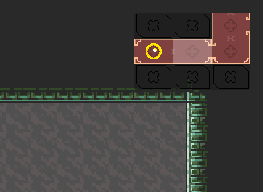

If your map theme has enabled shared borders, you need to call `MetSys.draw_shared_borders()` after you finish drawing your map. And if you use custom elements, you need to use `MetSys.draw_custom_elements()`, which also takes a few arguments:
- `canvas_item`: The CanvasItem that will draw the elements (can be the same as before).
- `rect`: The coordinate range to draw the elements. In case of the 3x3 minimap it would be `Rect2i(current_coords - (1, 1), (3, 3))`.
- `drawing_offset` (optional): Offset of the elements, in map coordinates.
- `layer` (optional): The layer of elements to draw. Defaults to the current layer.

Drawing map is a complex operation and might be tricky to use for the first time. But it will draw cells accurately, as defined in the theme, while taking in consideration all symbols and whether the cells are discovered or not. You can draw any cells of your world anywhere on the screen, as the system is very flexible. Note however that it's expensive, so make sure that your map does not redraw unnecessarily (especially when using shared borders). To redraw efficiently, take advantage of `MetSys.map_updated` signal and, in case of a minimap, also `MetSys.cell_changed`.

### Tracking player position

Tracking player position allows for automatically discovering cells and changing scenes when player goes out of bounds. Tracking position is performed by using `MetSys.set_player_position()`. The method takes a position relative to the current scene's origin (i.e. top-left corner of the room). Unless your map's root node is offsetted, you can just use player's `global_position`. The method has to be called each frame, after the player has done moving. Example:
```GDScript
... some input
move_and_slide()
MetSys.set_player_position(global_position)
```
MetSys will automatically detect if the current map cell is different and emit `cell_changed` signal, which you can use to update your minimap. When the position is in a different room, MetSys will emit `room_changed` signal that also contains the name of the new scene that you should load. The scene name is not a full path; you can get the full path by using `MetSys.get_full_room_path()` on its name.

You can display player's location on your map by using `MetSys.add_player_location()`. This method should be called once per map CanvasItem. It will add your player location scene defined in the [map theme](#map-theme) as child of that node and automatically move it when visible, based on your supplied player position. The method also optionally takes an offset, in case your map CanvasItem has some margins.

### Markers

A cell may have assigned any number of markers, out of the markers defined in map theme (each marker can be assigned only once). Markers assigned at runtime will override the symbol assigned in the Map Editor. They are stored as a bitmask, which means you can define and assign only 63 markers. If multiple markers are assigned, the one being last on the theme list will be used. Markers are usually assigned based on events, manually by players on map screen, or automatically via [storable objects](#storable-objects). Assign a marker using `MetSys.add_custom_marker()`, remove it using `MetSys.remove_custom_marker()`.

### Discovering

Cells on the map can be in 3 states: undiscovered, mapped and explored. Undiscovered rooms don't draw at all, explored rooms draw with the default style. Mapped rooms draw with an alternate style and rules that can be specified in the [map theme](#map_theme). You can manually discover cells using `MetSys.discover_cell()` or you can discover a group of cells (e.g. when picking up a map item) by using `MetSys.discover_cell_group()`. Cell groups can be defined in the [editor](#cell-group-mode). Discovering a cell emits `MetSys.map_updated` signal.

You can use `is_cell_discovered()` to check if a cell is discovered and `get_explored_ratio()` to get ratio of explored cells vs all cells.

### Storable objects

Storable objects are anything that you'd want its state to be stored (saved), e.g. switches, breakable walls, collectibles. The idea is that every object has an ID that identifies it. Mark an object as storable when it's being initialized (`_ready()`), providing a callback for when the object is already stored (usually `queue_free()`). If the object was already stored, the callback will be immediately called. If it's not, you call the store method at a specific event (the player pulls a lever, collects an item etc.). Objects can be either stored or not, and stored state can't be reverted (using the public API). If you need more object states or toggleable states, you can take advantage of MetSys' object IDs. Example storable object implementation:
```GDScript
# Chest.gd
func _ready():
	if MetSys.register_storable_object(self): # Calls queue_free() if already opened.
		return

	unrelated_call()

func open():
	MetSys.store_object(self)
	$AnimationPlayer.play("Open")
	await $AnimationPlayer.animation_finished
	queue_free()
```
The above example shows a Chest object. It's initialized in the beginning. When player opens a chest, it's marked as "stored" and plays the opening animation and then disappears. When the player enters the room again, the chest will disappear at start, because it was stored and the callback will be called. Few things to note:
- `register_storable_object()` takes a callback, but defaults to `queue_free()` for Nodes and `free()` for non-RefCounted Objects.
- The callback is called only when registering. Storing an object just toggles a flag, it doesn't do anything in itself.
- `register_storable_object()` returns `true` when the object was already stored, so you can use it to stop further initialization logic.

Alternate method for registering objects is `register_storable_object_with_marker()`. It takes object, callback and marker index. When used, the object will be be marked on map when it first appears and marked again when stored (collected etc.). You can define default markers in [map theme](#map-theme) (use the index from the symbol list). If marker index is -1, that marker will not appear. You can make marker appear only when the object is discovered or only when it's stored or both. Also you can provide a custom symbol index to the method to customize how the element is marked on the map.

Separately from the storable objects there exists an object ID system. It's used by storable object methods to determine whether the object was stored or not, but it can be used manually. The ID is a String and is determined ad hoc from the object instance. If the object is a Node, the ID will be created from scene name, parent node and node name. E.g. if you have this scene structure:
```
Map (Forest.tscn)
- Objects
  - Chest
```
The Chest will have ID `Forest/Objects/Chest`. This system ensures that any node in your world can be identified by unique ID (conflicts are possible, but typical usage won't cause them), thus allowing for automatic saving of object's state. You can get ID of any object by using `MetSys.get_object_id(object)`

If your object is not a node, or for some reason you want them to share ID, you can manually assign ID by setting `object_id` metadata, e.g. `object.set_meta(&"object_id", "my_id")`. Another alternative is implementing `_get_object_id()` in the object (the returned ID will be cached in meta). The meta and method will have priority over the auto-ID. If the ID can't be determined, `get_object_id()` will return empty String.

Another related method is `get_object_coords()`. It works just like `get_object_id()` (including `object_coords` meta and `_get_object_coords()` method), but instead it returns object's coordinates on the world map. You can use it to draw custom ad hoc stuff on the minimap or manually assign object markers. If the provided object is a Node2D, it will return an accurate coordinates. If it's a plain Node, it will return coordinates of the top-left corner of the current room (note that it needs to be inside a scene assigned to some map room). If the coords can't be determined, `Vector3i()` is returned.

### Cell overrides

Cell overrides allow for runtime modifications of the map. You can change any room's property, i.e. color, borders or default symbol and even the assigned scene. Typical use-cases are opening passages when destroying walls, marking hazardous rooms based on current upgrades or changing a room to a "destroyed" version (e.g. when SA-X visits it).

To override a cell, you can call `MetSys.get_cell_override()`. The method takes Vector3i coords of the cell. If an override already exists, it will return existing one. If it doesn't, it will be automatically created (unless you use `false` as the second argument). The method returns an object of type CellOverride that can be used to customize the cell. The customization is done using a set of methods. Note that the `value` argument in each method is optional; using default value makes the override reset it to default.
- `set_border(idx, value)`: Sets the border type. `0` is passage, `1` is wall, `2+` are custom styles defined in theme. You can also use `-1` for no border, but it's not recommended. `idx` is the direction of the border. Use `MetSys.R`/`D`/`L`/`U` enum constants to select border direction.
- `set_border_color(idx, value)`: Sets the border color.
- `set_color(value)`: Sets the cell's center color.
- `set_symbol(value)`: Sets the cell's symbol. This is separate from custom markers.
- `set_assigned_scene(value)`: Sets the cell's assigned scene. The scene should be full path (with extension) to the scene, without the root folder prefix. E.g. if your `map_root_folder` is `res://Maps` and your map is in `res://Maps/DarkWorld/Desert1.tscn`, you should assign `DarkWorld/Desert1.tscn`. You can also assign an absolute path to the scene, even from `user://`, but then you'll need to add special handling in your code. Note that unlike other functions, assigning scene has effect on all cells in a room, to keep consistency.

Override can be deleted with `MetSys.remove_cell_override()`, which takes override's coords. The override does not need to exist, so the method is safe to call (unless the cell itself does not exist). Modifying and removing overrides will emit `MetSys.map_updated` signal.

### Map Builder

Map Builder is a tool to create custom rooms at runtime. It's intended for procedurally generated maps. You can obtain a MapBuilder object using `MetSys.get_map_builder()`. The Map Builder is a very simple class. It has 2 methods: `create_cell()` and `update_map()`. `create_cell()` takes coordinates of the new cell and will return CellOverride object, the same as when overriding rooms. You can customize the cell by customizing the received override object. `update_map()` will cause MetSys to emit the `map_updated` signal (overrides from custom cells don't do it automatically). Call it when you have finished generating the desired layout.

The overrides from map builder allow calling `destroy()`, which will remove the custom cell completely. You can obtain references to custom cells you have created by accessing `cells` property of the Map Builder. Note that, since custom cells are overrides themselves, using `MetSys.get_cell_override()` on a custom cell will not create a new override.

### Saving and loading MetSys runtime data

MetSys comes with a simple save system that allows you to serialize its runtime data. Stored things include:
- discovered cells
- registered storable objects
- stored objects
- custom markers
- cell override data (however if you created cells with Map Builder, you need to store their coords yourself if you want to modify/destroy them in the future)

This means that you don't need to worry about keeping the data of runtime MetSys operations, the system does it for you. To obtain the data, use `MetSys.get_save_data()`. It returns a Dictionary with the aforementioned contents. You need to save it yourself, e.g. using `store_var()`, `var_to_str()` or by adding it to your own save system. Note that using JSON is not recommended, because the data contains Godot's native types and integers.

To restore the data use `MetSys.set_save_data()`, passing the saved Dictionary. It will restore all discovered cells, stored objects etc. If you give empty Dictionary (default), the data will be cleared. When starting a new game session, you should always call `MetSys.reset_state()` and `MetSys.set_save_data()`. The former will reset the singleton to make sure player position and other variables are properly cleared. The latter will initialize the save data; you should always call it if you want to use save data, as otherwise the data is `null`.

## Map Theme

Map theme is a very important element of MetSys (unless you don't use the map drawing component). It defines the appearance of your map. The theme is a custom resource class and it can be changed in the [database settings](#general-settings).

### Properties

The theme has a long list of properties, divided into sections.

#### Main properties

- Center Texture: The most important texture. It draws as a base of your cells, but also defines their size and shape. The texture should be grayscale (preferably white), because it will be modulated.
- Empty Space Texture: Optional. Texture that draws in empty or undiscovered coordinates when drawing cells. Also drawn in Map Editor.
- Player Location Scene: Optional. The scene instantiated when using `add_player_location()` method. The root must be Node2D-derived. If not provided, drawing player location using MetSys methods is not possible.
- Show Exact Player Location: If enabled, the player location scene will be drawn at the exact position in the cell (player position is remapped to relative position inside a cell). If disabled, the player location is always drawn in the center of the cell.
- Mapped Display: Defines how mapped rooms are displayed.
	- Center - If disabled, center texture will not be drawn.
	- Outline - If disabled, room walls will not be drawn.
	- Borders - If disabled, walls will be drawn instead of passages.
	- Symbol - If disabled, symbols will not be visible.
- Use Shared Borders: If enabled, borders will be shared between adjacent cells. Otherwise borders are drawn fully inside the cells. This option makes drawing the map more expensive in terms of performance.

#### Colors

- Default Center Color: Modulation of the center texture when it's not overriden by custom color.
- Mapped Center Color: Modulation of the center texture when the cell is mapped.
- Default Border Color: Modulation of the border textures when it's not overriden by custom color.
- Mapped Border Color: Modulation of the border textures when the cell is mapped.

#### Symbols

- Symbols: The list of available symbols. A symbol will always appear centered at the cell. It can be bigger than the center texture, but it's not recommended.
- Uncollected Item Symbol: Symbol automatically displayed when calling `register_storable_object_with_marker()`. The number must be within the array defined in Symbols. `-1` is no symbol.
- Collected Item Symbol: Symbol assigned when using `store_object()` on a marked object. `-1` is no symbol.

#### Border Textures

Note that all border textures should be grayscale, preferably white, because they are colorized.

- Wall: The texture used for a wall, i.e. the default impassable border. The texture is facing east (right), so it should be thin line with the same height as the center texture. Don't make it too thick to prevent overlaps.
- Passage: The default texture used for passage, i.e. passable border. Same rules as above.
- Separator: Optional. The texture used to draw fake border between cells. It draws inside rooms and separates them into grid. If the height is lower than center texture's, the separator will be centered. It's recommended to make it least prominent possible, otherwise it might hurt map readability and cause confusion.
- Borders: A set of alternate borders that can be set in addition to the default wall and passage. They can be anything; usually used for doors, barriers etc.

If your theme has rectangle shape (determined by the center texture), the above properties are instead split into vertical and horizontal variants.

- Vertical Wall/Passage/Separator/Borders: The vertical texture for borders, which draws on sides. The height should match center texture's height, just like above.
- Horizontal Wall/Passage/Separator/Borders: The horizontal texture for borders. For drawing simplicity it's also oriented vertically, but its height should match the *width* of the center texture.

#### Corner Textures

Corners draw at the connection point of borders and will overlap the border textures. They can't be colored explicitly, instead their color is average color of the adjacent borders.

- Outer Corner: The texture that draws at the outer bounds of the room.
- Inner Corner: This texture only appears in concave (non-rectangle) rooms and draws at the corners inside the room.

When using shared borders mode, the above corner textures are instead replaced by this set. The coloring rules are a bit different - if multiple borders meet at the same corner, the resulting color will favor custom colors instead of the default one.

- U Corner: Corner of a single border that divides U-shaped room.
- L Corner: Corner of 2 perpendicular borders.
- T Corner: Corner of 3 borders connecting at one point.
- Cross Corner: Corner of 4 borders.

### List of included example themes

The addon comes with a few themes *inspired* by various metroidvania games. They are found in the Themes directory of the addon.

#### AoS


Inspired by Castlevania: Aria of Sorrow. Simple blue squares with white, shared borders. Notably it displays room connections as colored lines. Has no symbols. Player location is white shrinking dot, mapped rooms display all connections.
#### BS


Inspired by Bloodstained: Ritual of the Night. Rectangular light-blue cells with shared borders and normal room connections (i.e. hole-like). Also no symbols. Player location is a stylized dot showing exact location and passages show normally in mapped rooms.
#### Exquisite
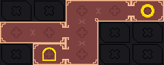

Original (and default) theme created for MetSys. Rectangular cells, customizes every available element of the theme to look fancy. Has a few random symbols. Player location is a rotating symbol that shows exact position. Symbols appear in mapped rooms, but not passages.
#### MF
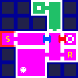

Inspired by Metroid Fusion. Simple square cells defaulting to magenta color and a texture for empty cells. Has a bunch of symbols and extra border styles for doors. Includes symbols for collected and uncollected items. Player location is a blinking square. Symbols appear in mapped rooms, but not passages.
#### SotN


Inspired by Castlevania: Symphony of the Night. Basically the same as BS, but with square rooms. Player location similar to AoS, but animated a bit differently.
#### RR
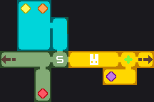

Inspired by Rabi-Ribi. Unlike other themes, cell borders are colored. Has many symbols, including various collectibles. Notably, the collectible symbols are displayed only when a collectible is acquired. Player locations is a rounded square with smoothed blinking. Mapped rooms display everything normally.
#### VoF
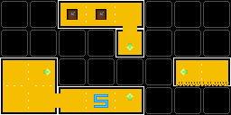

Inspired by Voice of Flowers (which is created by me). In fact it uses some of the old sprites from the game. Square cells with visible separators and a texture for empty space. Has a bunch of various symbols of mixed quality and an extra border style for abyss. No symbols for collectibles. Player location is a rotating head. Mapped rooms don't display anything, just cell color without any borders.
#### Zeric
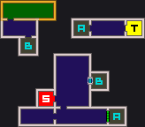

Inspired by map guides made by user Zeric ([Example](https://gamefaqs.gamespot.com/gba/589456-castlevania-aria-of-sorrow/map/772-castle-map)). The only theme that uses all possible corner styles for shared borders. Has a few non-collectible symbols and extra border styles. Player locations is a symbol, mapped rooms display everything.

## Sample project

This section describes the features of the included sample project and where to find them. You can find more details in the code comments.

The project is a little metroidvania game. The target is to collect 6 orbs and reach the ending point. The world is composed of 3 layers and in different rooms it shows various system's capabilities.

**DISCLAIMER:** The sample project is not by any means a legit game. It's full of hacks and questionable solutions. The point is to show an example integration with the MetSys, not how to make a good project. As a Godot contributor would say - TIWAGOS.

### Main elements

Top-level elements of the project, not related to specific rooms.

#### Game scene - room transitions, map and minimap

`Game.tscn` is the main scene of the project. It contains player with camera and UI. Player is a separate scene with CharacterBody2D root. It uses the default template controller, with some modifications like double jump and reset position. UI elements are Minimap, FullMap (with Percent) and CollectibleCount. Their logic is contained inside built-in scripts. The CollectibleCount is managed by Game, which has the only external script in this scene.

Game scene manages room transitions and project-specific save data. Check the comments in `Game.gd` for more details. Other functions in this scene are Minimap, Map Window and discovered percentage label.

#### Collectibles

Orb collectible is scene `Collectible.tscn`. It's a storable object - collecting it will make it never appear again. It shows a marker when discovered and when collected. It also increases the Game's collectible counter. `MapItem.tscn` is the same, but instead of increasing a counter it discovers a room group.

#### Custom elements

`CustomElements.gd` shows an example implementation of `CustomElementManager`. The available elements are elevator and label.

### Specific rooms

Room-specific things that show various features.

#### Right Staircase - map collectible, secret wall

`RightStaircase.tscn` has a map item collectible that discovers part of the world's map. It also has a secret, which is a storable object without marker and creates a cell override to show a newly discovered path. Notice how the map updates when you enter the fake wall area (it's located on bottom right of the room).

TileMap node has a script that disables collision on the Fakeground layer (i.e. fake wall). MapItem is it's own scene, Secret node handles the override.

#### Lava Corridor - room group override, scene assign override, custom object IDs

A corridor with lava. The interesting fact about it is that it uses 2 scenes: `LavaCorridor.tscn` and `LavaCorridorAfterwater.tscn`. After a certain condition is met, the assigned scene is changed to the latter one, so entering this room's cell will switch to a different scene without lava. The color of the cells on the map also changes.

Overrides are performed in `LeftStaircase.tscn`, but another interesting thing is the orb in this room. It exists in both scenes, yet MetSys can correctly deduce that you collected the orb previously registered in another scene (the orb is inaccessible until you get rid of the lava). It's thanks to `object_id` metadata, which for both orbs is `lava_orb`. This allows to register and store the same object in different scenes.

#### Left Staircase - unlocking shortcut, one-time switches

`LeftStaircase.tscn` shows how to make a persistent event button. When the player touches the blue button, it will switch to pressed state and emit the pressed signal. The button is a storable object; it's stored on the first press, so when entering the room afterwards, it's pressed immediately (it still emits the signal to notify other objects).

The receivers of the signal is GateOpen node and Pipe. GateOpen will disable the Gate TileMap layer, opening the shortcut. The pipe will start animation when it receives the signal. However it keeps a separate event (in an event array unrelated to MetSys), so when the button notifies it again when entering the room, the animation will be skipped.

#### Portal Room - moving between map layers

`PortalRoom.tscn` is one of the portal rooms. It has the Portal node responsible for changing layers. Although in fact the layer changing comes indirectly. What the portal does is changing the scene, the actual layer is assigned in `Game.gd` in `goto_map()` method.

#### Dark Staircase - irregular room with off-map drawing

When a room is not rectangular, there will be space where camera can go outside the map. This can be handled in multiple ways. The simplest one is just drawing tiles outside the map, so that player won't see empty space. This approach can be unreliable. Other ways involve drawing a plain color/pattern outside the map or constraining the camera to be only within the used cells. Both can be achieved by using `get_local_cells()` method. `DarkStaircase.tscn` shows the former approach, i.e. drawing plain color; the code is in Outside node.

#### Dice Room - procedurally generated rooms

`DiceRoom.tscn` and the related `Junction.tscn` contain the most complex logic in the sample project. Touching the dice in dice room will generate a couple of procedural rooms and put a collectible into furthest one of them.

The whole script for generating rooms is in the Dice node. The general idea is that it "generates" and saves scenes, puts them on the map and picks the further room to insert an orb. Check the Dice script for details. The `Junction.tscn` has an orb with a custom ID.

Important to remember is that while the MetSys editor works with scene paths relative to the map root directory, when assigning an override you can assign it any absolute path (e.g. from `user://`). Do note that for RoomInstance to work correctly, the path still needs to point to a valid, unique scene resource.

### Misc

Stuff not directly related to MetSys.

- `ElevatorRoom.tscn` shows how to make a Metroid-esque elevator to move between rooms. Related: `Elevator.tscn`.
- `EndingPoint.tscn` has example ability and an ending point based on collectibles.

## Closing words

MetSys is the most complex system I have designed and written. It's a result of my years of experience in making and playing different metroidvania games. Hopefully it helps someone make a great metroidvania and I'll be able to play it in the future ;)

The addon is fully open-source, so feel free to dive into the code and adapt it to your needs. If you find bugs or shortcomings in some features, or maybe something is not properly explained, feel free to open an issue. Feature requests are also welcome, but I can't promise I'll be implementing them.

Have fun.

___
You can support my metroidvania game by [adding it to your wishlist on Steam](https://store.steampowered.com/app/2609560?utm_source=GitHub&utm_medium=README&utm_campaign=MetSys#game_area_purchase).

You can find all my addons on my [profile page](https://github.com/KoBeWi).

<a href='https://ko-fi.com/W7W7AD4W4' target='_blank'></a>
